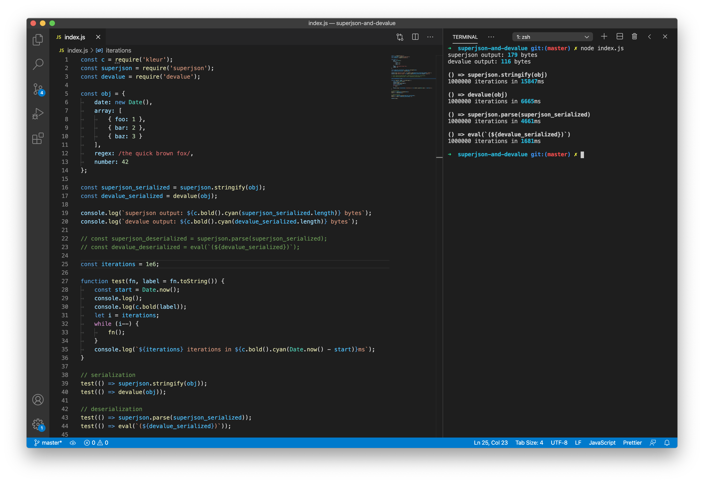

# superjson-and-devalue

quick script to compare the performance/output of [superjson](https://github.com/blitz-js/superjson) and [devalue](https://github.com/Rich-Harris/devalue), following [this Twitter thread](https://twitter.com/flybayer/status/1285964795183652867).

```
git clone git@github.com:Rich-Harris/superjson-and-devalue
cd superjson-and-devalue
npm i
node index.js
```

The sample object is small and simple — different objects may have different outcomes.

Note: I couldn't get things like Sets or repeated references to work with superjson (it complained about circular references).



## Bundle size

To see how much `superjson.deserialize` adds to the client bundle, run this:

```
npm run build
cat bundle-size/output-superjson.js | wc -c
```

(With Terser installed globally, you can do `cat bundle-size/output-superjson.js | terser -cm | wc -c` to check minified size, or chuck a `| gzip -9` in there to see zipped size.)

## Results


```
superjson output: 232 bytes
tson output: 313 bytes
devalue.uneval output: 203 bytes
devalue.stringify output: 252 bytes
arson output: 218 bytes

() => superjson.stringify(obj)
1000000 iterations in 12995ms

() => tson.stringify(obj)
1000000 iterations in 6031ms

() => uneval(obj)
1000000 iterations in 6760ms

() => stringify(obj)
1000000 iterations in 7026ms

() => ARSON.stringify(obj)
1000000 iterations in 4421ms

() => superjson.parse(superjson_serialized)
1000000 iterations in 5329ms

() => tson.parse(tson_serialized)
1000000 iterations in 3037ms

() => eval(`(${devalue_unevaled})`)
1000000 iterations in 875ms

() => ARSON.parse(arson_stringified)
1000000 iterations in 2828ms

() => parse(devalue_stringified)
1000000 iterations in 2446ms
```

`superjson.deserialize` adds 12.3kb to your client bundle size. (`devalue` adds 0kb, because there's no runtime.)
